

# Intelligent Telepresence Assistive Device (iTAD)

    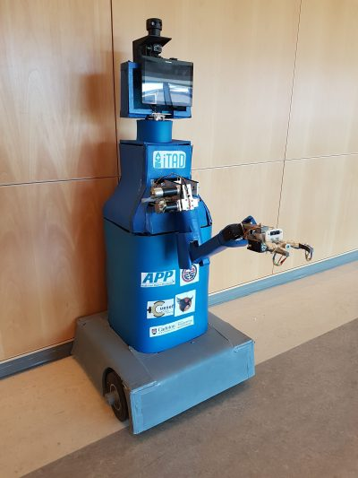

> Intelligent Telepresence Assistive Device (iTAD) in a netural state.

---

### Table of Contents

- [Description](#description)
- [Features](#features)
- [My Contribution](#my-contribution)
- [Contributions](#contributions)
- [Author Info](#author-info)

---

## Description

<h3><u>What are telepresence devices?</u></h3>

Telepresence devices use robotic platforms equipped with sensors and communication tools to execute tasks remotely. Commercially-available models typically offer limited mobility and interaction capabilities. Many lack a means of allowing the user to physically interact with the remote environment and are not designed to be accessible by people with disabilities, barring them from effectively using this up-coming technology.

<h3><u>What is iTAD?</u></h3>

Intelligent Telepresence Assistive Device (iTAD) is a robotic platform which facilitates real-time communications and remote interactions in a variety of application areas. iTAD aims to address technological barriers which can prevent people with disabilities from accessing the healthcare they need or communicating/interacting with loved ones in independent living centres. iTAD can make healthcare more accessible by connecting remote medical professionals and patients, including those that are permanently or temporarily disabled, as well as assist nurses, other doctors and family members. In independent living facilities, iTAD can aid the elderly with different tasks such as walking, eating, administering medications, and remotely communicating with healthcare professionals. iTAD’s robust design and versatility offers a cost-effective solution for addressing a variety of scenarios that help connect individuals and facilitate interactions. In addition, iTAD is designed to safely fit within dynamic hospitals and independent living facilities, requiring no changes to be made to existing infrastructures.

[Back To The Top](#project)

---

## Features

<h3><u>The Head</u></h3>

 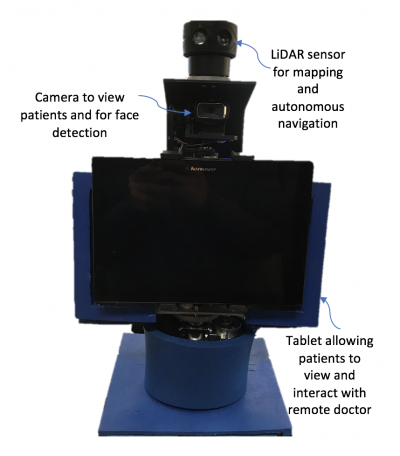

The head is compromised of the tablet, camera, and LiDAR (Light Detection and Ranging) sensor. An end-user is able to engage in natural-feeling interactions thanks to the centralized head structure making it possible to look at the tablet while looking into the camera. The tablet streams the live audiovisual stream from the desktop application. Facial detection software is used to detect the largest face in a frame, allowing the camera to follow it by using the camera’s pan and tilt functions, preventing the remote user from needing to constantly readjust the camera during a conversation. The camera’s pan and tilt functions and the removable tablet allow people at different heights to accessibly communicate through iTAD. In addition, the head is able to rotate via the neck structure, allowing users to easily address someone not directly in front of iTAD. The LiDAR sensor enables iTAD to map its surrounding area for autonomous navigation.

<h3><u>The Arm</u></h3>

 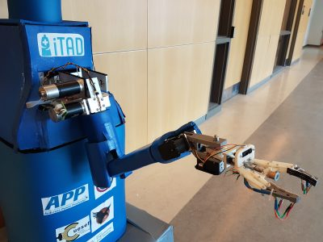
 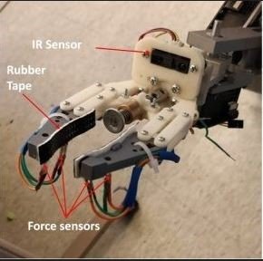

The communication experience is further enhanced with the use of a <b><u>5 degree-of-freedom (dof) arm</u></b>, allowing the user to physically interact with a large area within its surroundings. The position of the end-effector, or gripper, can be intuitively controlled by toggling between arm and drivetrain control on the main controller. The versatile <b><u>gripper</u></b> design allows effective grasping of objects with different dimensions and surface finishes. The gripper is instrumented with force sensors and proximity infrared sensors to safely grasp objects and push items. Also, the gripper can be equipped with diagnostic tools, such as a heart rate sensor, to assist remote doctors with patient check-ups.

The <b><u>arm</u></b> can assist people with disabilities by performing various tasks; examples include:

- Lifting light objects
- Moving IV poles
- Flicking light switches
- Pushing elevator buttons (also essential for autonomous navigation capabilities)

<h3><u>Additional Features</u></h3>
<h4> Communication Platform</h4>

The highly configurable nature of iTAD’s communication platform allows for the addition of features to ensure that iTAD is compliant with accessibility standards; these include:

- Voice commands for the main functions of the robot, such as start-up and autonomous navigation.
- Filters to assist the visually impaired and individuals who lip-read to view video feeds.
- Real-time subtitles via voice-to-text converters and text-to-voice converters to allow effective communication with deaf or hard-hearing individuals.

<h4> Autonomous Navigation</h4>

To navigate autonomously, a LiDAR (Light Detection and Ranging) sensor maps iTAD’s surroundings, identifying where it is and calculating a path to get to its destination autonomously, by referencing a larger map of the environment.

The video shown demonstrates iTAD’s current mapping abilities. As iTAD, denoted by the right-angle-connected red and green lines, moves throughout a house, it maps the house’s barriers, shown as the black lines, as well as iTAD’s trajectory, shown as the bright green line. Path planning algorithms are then applied to plan a path from iTAD’s current location to a desired location chosen by a user on the map.

https://user-images.githubusercontent.com/35279249/184552282-5e54822b-e0f5-4f1f-b2eb-ef36244b4058.mp4

[Back To The Top](#project)

---

## My Contribution

> > Please note that a more detailed and thorough walk-through of the wiring and PCB production process can be found in [Final Report](files/FinalReport.pdf). This section will just give a brief overview of some of the actions taken to acheive a successful wiring and functioning layout.

<h3><u>Purpose</u></h3>

One of the focus for this years team was to improve the wiring organization and
overall appearance of the iTAD robot. To accomplish this goal, majority of the
wires can be implemented on a PCB board to remove the visible wires as well
as uphold its functionality. Currently, the wiring state of the robot is a disaster
and needs to be organized. For a better insight, majority of the wires are tangled
with one another and is hard to see where certain wires are connected as some
do change colour mid-way. Some wires can also be easily disconnected when a
small external force is applied to the wire.

The following sections will explore how the schematic and board layout was devel-
oped using EAGLE and diffrent techniques used to ensure a fast and responsive
PCB for the PWM and the Odroid section of iTAD.

There was no prior schematic given to us for the existing robot so I had to design and verfiy both the communication and motor schematic. The image below showcases the two schematics that were genereated using CircuitMaker.

<table>
  <tr align='center'>
    <td>Communication Schematic</td>
     <td>Power Schematic</td>
  </tr>
  <tr>
    <td>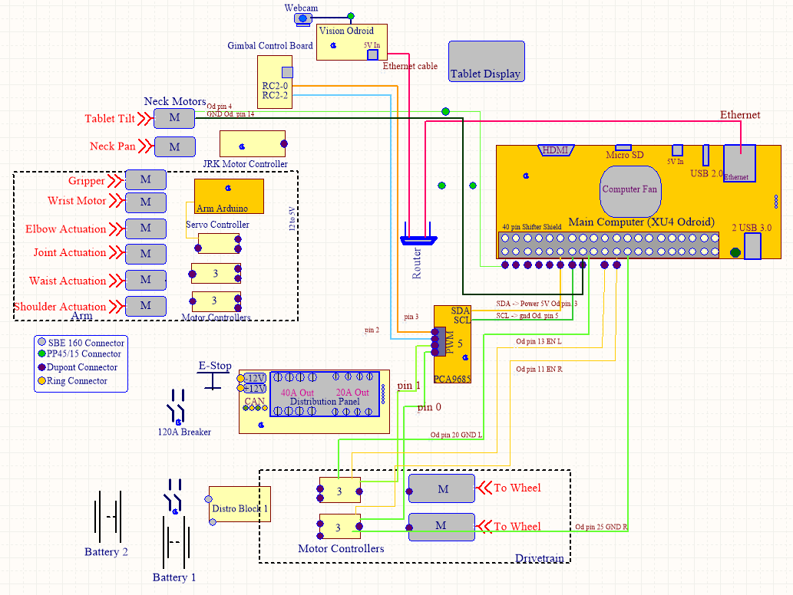</td>
    <td></td>
  </tr>
 </table>

<h3><u>Summary</u></h3>

First off, a visionary
overview that shows how a PCB will be used to better the wire
organization of the robot. It can be seen below in Figure 1.

 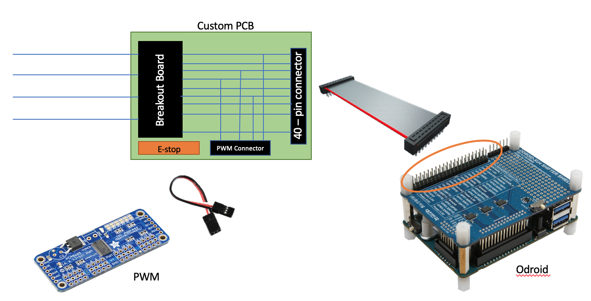

From this vision, a schematic was created along with a table of components,
Figure 2 and Table 1, respectively.

<figure align='center'>
 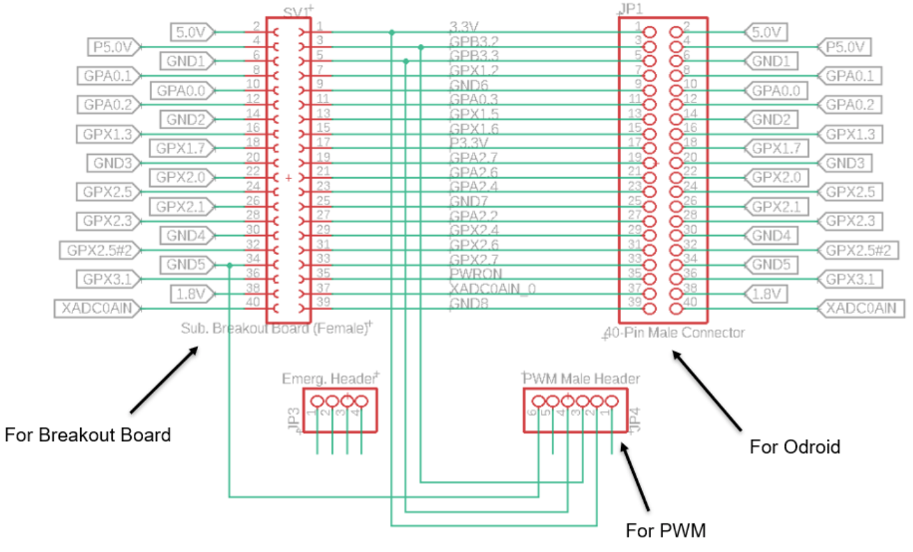
 <figcaption>Figure 2: Schematic of PCB for Odroid and PWM wire management</figcaption>
</figure>

<figure align='center'>
 <figcaption>Table 1: List of components that will be mounted on the PCB</figcaption>
 
</figure>

The future goals mentioned in tech memo 1 mentioned finalizing the list of
components and inserting the terminal block in the schematic which was substi-
tuted with a 40-pin female header. Once these would be completed, Professor
Qadi would review the design and components and proceed with the manufac-
turing and construction of the PCB.

After self learning EAGLE and the use of various important libraries, I was able to create a final gerber file that showcased how the internal wiring of the PCB would look. Figure 3 shows the gerber file below.

> The gerber files for all layers of the PCB can be found under the [Gerber File](/files/CAMOutputs/GerberFiles/) folder.

<figure align='center'>
 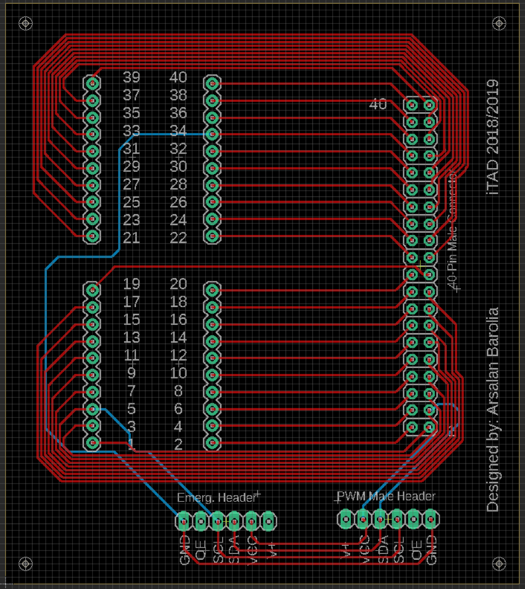
 <figcaption>Figure 3: Finalized board layout along with its physical connections</figcaption>
</figure>

Labels and text were also added using the text function on EAGLE that
could be seen on the silkscreen layer. This writing helps indicate the person
using the PCB where all the pin numbers are to avoid any errors in the wiring.
Please note that the red wire in Figure 3 was routed on the top layer of the cop-
per whereas the blue indicates the connections at the bottom layer. This helps
organize the different wires without having too many wires on one layer. Once
the board was produced, the ERC (Electrical Rule Check) and DRC (Design
Rule Check) was used to check that no additional or unnecessary wires were
connected on the schematic and the board, respectively. No errors were found.
Thus, the board was ready to be manufactured and sent to PCBway. Figure 4 displays the specs that were selected help manufacture the PCB based on the Gerber files sent.

<figure align='center'>
 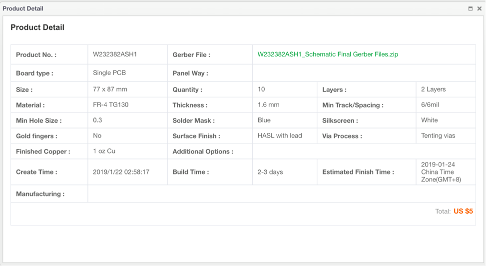
 <figcaption>Figure 4: Product detail of the PCB sent to PCBway based on the Gerber Files</figcaption>
</figure>

These specifications were chosen and selected based on the Gerber files sent.
Gerber files help manufactures know exactly what is on every layer of your PCB
and the specifications you set during the design process. Figure 5, below, depicts
an example of the Gerber file for my board layout.

<figure align='center'>
 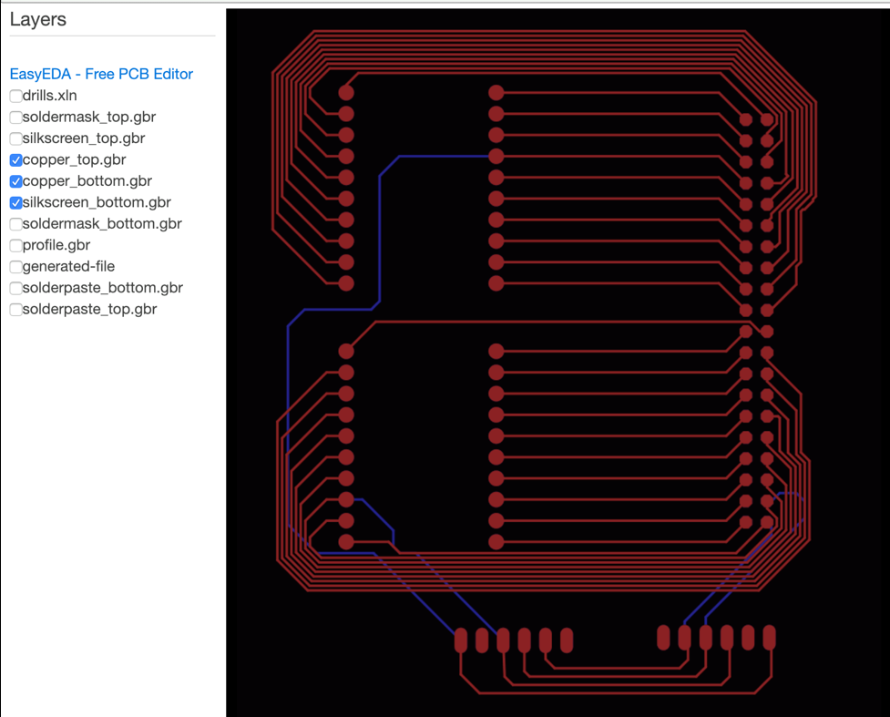
 <figcaption>Figure 5: My PCB Gerber file using an online Gerber viewer</figcaption>
</figure>

This Gerber file was viewed using an online Gerber viewer. It is very impor-
tant to view your Gerber file using an online viewer or another software as some
compiling issues do occur. This allows the designer of the PCB to verify that
the connections on the PCB are correctly routed and that the manufacturer
knows how the PCB needs to be produced.

Once this order was processed, the PCB was shipped and delivered along
with its components, in 1 week and 2 days, respectively. In the figure below,
Figure 6, an image of the PCB manufactured is shown.

<figure align='center'>
 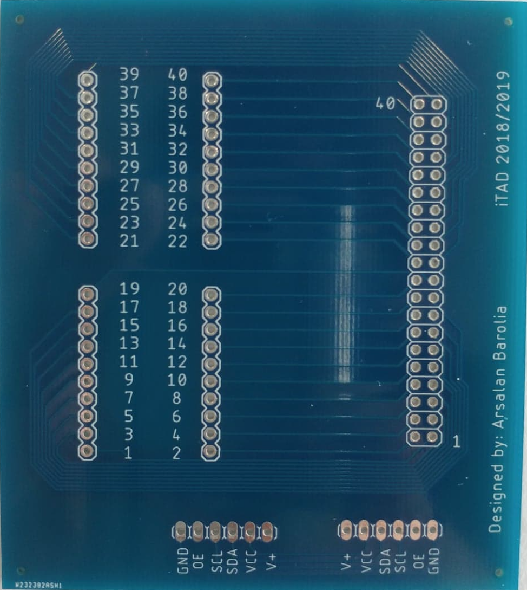
 <figcaption>Figure 6: Manufactured PCB from PCBway</figcaption>
</figure>

[Back To The Top](#project)

---

## Contributions

<h4>Class of 2020 MAAE 4907 at Carleton University</h4>
- Team of 25 students

[Back To The Top](#project)

---

## Author Info

<h4> Arsalan Barolia</h4>

- LinkedIn - [https://www.linkedin.com/in/arsalanbarolia/](https://www.linkedin.com/in/arsalanbarolia/)
- GitHub - [https://github.com/arsalanbarolia](https://github.com/arsalanbarolia)
- Website - [Enter domain here](enter domain here)

[Back To The Top](#project)

---
